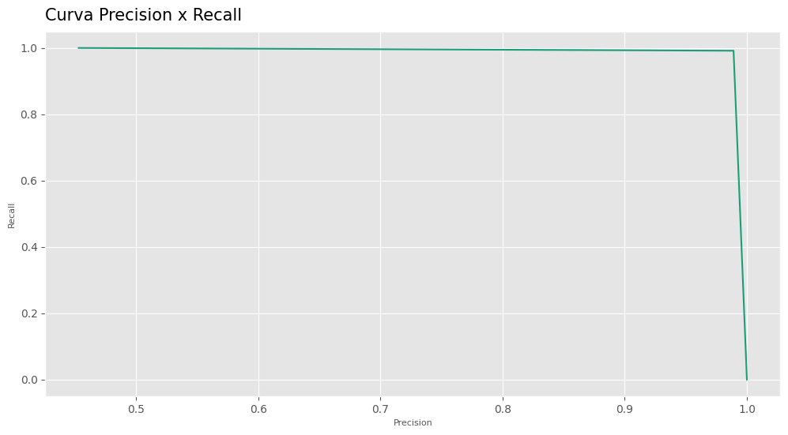
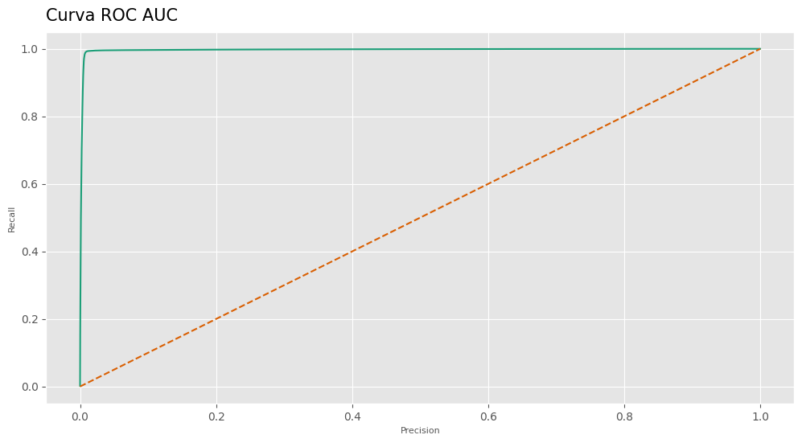

# Kaggle Playground Series S04E08
## Binary Prediction of Poisonous Mushrooms

### Conteúdo
- [Introdução](#introdução)
- [Metas e objetivos](#metas-e-objetivos)
- [Dados](#dados)
- [Métodos e modelos](#métodos-e-modelos)
- [Resultados](#resultados)
- [Ferramentas utilizadas](#ferramentas-utilizadas)

## Introdução
O dataset para esta competição (tanto o de treinamento quanto o de teste) foi gerado a partir de um modelo de aprendizado profundo treinado com o conjunto de dados de Cogumelos da UCI. As distribuições das variáveis são próximas, mas não exatamente iguais, às do original. Sinta-se à vontade para usar o conjunto de dados original como parte desta competição, tanto para explorar as diferenças quanto para verificar se a incorporação do original no treinamento melhora o desempenho do modelo.

## Metas e objetivos
O objetivo deste projeto é (1) encontrar o modelo que se adeque melhor a métrica de avaliação da competição (o Matthews Correlation Coefficient), e (2) após 4 submissões quero ter documentada essa tentativa da minha primeira competição no Kaggle. Meu melhor resultado foi 0.97837. 

## Dados
A descrição completa dos dados pode ser encontrada na [página da competição](https://www.kaggle.com/competitions/playground-series-s4e8/data). 

## Métodos e modelos
####  Pré-processamento e otimizações
- Scikit-learn, Optuna, Category Encoders, Feature Engine.
#### Modelos
- LightGBM.
#### Métricas de avaliação
- Matthews correlation coefficient, ROC AUC, F1 Score, Accuracy.

## Resultados
O modelo final para a submissão teve essas métricas:
|Métrica|Resultado|
|---|---|
|**Accuracy**| 0.9912622776468626|
|**ROC AUC**| 0.9968762964639637|
|**F1 Score**| 0.9903703192980782|
|**MCC**| 0.9823787995025628|
#### Visualizações

## Ferramentas utilizadas

